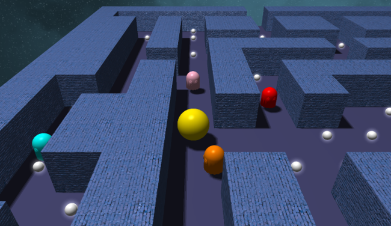

# Pacman 3D in OpenGL

A 3D reimagining of the classic Pacman game, built from scratch using C++ and modern OpenGL. This project was developed as part of the "Graphic Processing Systems" course.

The game retains the original mechanics: a maze, collectible coins, and ghosts to avoid, but introduces a 3D perspective with a dynamic follow-camera, advanced lighting, and several modern rendering techniques.

---

## Features

* **Full Game Logic:** Features grid-based movement, coin collection, ghost collision detection, a teleportation tunnel, and win/loss states.
* **3D Models:** Pacman is represented as a level-3 subdivided sphere, and the ghosts are loaded from `.obj` files with per-vertex normals.
* **Dynamic Camera:** Third-person camera that smoothly follows Pacman, with orbital rotation controlled via the mouse.

---

## Technical Details & Rendering Techniques

This project implements a customized two-pass rendering pipeline and several advanced graphical techniques:

* **Shadow Mapping (PCF):** A 2048x2048 off-screen depth map is generated from an orthographic directional light. It uses Percentage Closer Filtering on a 3x3 grid and adaptive bias to render soft, acne-free shadows.
* **Normal Mapping & Lighting:** Implements the Phong reflection model using two light sources: a main directional light and a dynamic "headlamp" attached to the camera. Maze walls utilize tangent-space normal mapping to simulate complex geometry.
* **Greedy Meshing Optimization:** A naive rendering approach would require hundreds of draw calls for the maze. This game uses a greedy meshing algorithm that combines adjacent wall cells into large geometric segments, drastically reducing draw calls and scaling UV coordinates proportionally.
* **Halo Effect (Billboarding & Additive Blending):** Coins emit a glowing halo effect created by drawing a quad that always faces the camera (billboarding). The edges fade out radially in the fragment shader, and additive blending (`GL_ONE`) composites the light naturally without needing a heavy bloom post-processing pass.
* **Smooth Interpolation & DeltaTime:** All movement and rotation are multiplied by `deltaTime` to ensure consistent speed across different hardware. Linear interpolation is used for smooth positional transitions and shortest-path angular rotations.
* **Skybox:** The background is rendered using a 6-texture cubemap, optimized by drawing it last in the pipeline with a `GL_LEQUAL` depth function.

---

## Controls

| Key / Input | Action |
| :--- | :--- |
| **W / S** (or Up/Down Arrows) | Move Pacman Forward / Backward |
| **A / D** (or Left/Right Arrows)| Rotate Pacman 90° Left / Right |
| **Left Click + Drag** | Rotate the camera around Pacman |
| **N** | Toggle Normal Mapping on/off |
| **G** | Toggle Coin Glow effect on/off |
| **M** | Toggle Shadow Mapping on/off |
| **F** | Toggle Fullscreen mode |
| **R** | Restart the game |
| **ESC** | Exit the application |

---

## Dependencies

* **OpenGL 4.0**
* **C++**
* **GLEW** (Extension Wrangler)
* **FreeGLUT** (Window & Input Management)
* **GLM** (OpenGL Mathematics)
* **stb_image** (Texture loading)

---

## Future Improvements

* Implementation of BFS/A* pathfinding for ghost AI tracking.
* Dynamic procedural generation of the maze layout.
* Post-processing Bloom and Gaussian blur.
* Real-time score UI and a life system.
* Procedural animations (e.g., Pacman's mouth opening/closing).

---